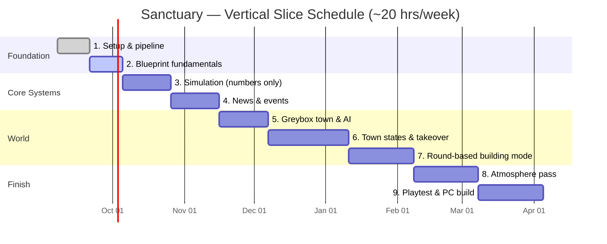

# Sanctuary — Development Roadmap

Solo project, ~20 hrs/week, Unreal Engine 5 (Blueprints first), Blender, Claude Code.
Target: playable **vertical slice** on PC in ~26 weeks. Consoles after (needs Windows PC + dev program).

**How to use this file:** phases go in order. Tick boxes as work lands. Move the `👉 CURRENT` marker when a phase starts. Claude Code reads this every session — keep it honest.

---

## Timeline

Legend: `[x]` done · `[ ]` not started · `[~]` in progress

---

## Phase 1 — Setup & pipeline (Sep 7 – Sep 20) ✅

**Done when:** Claude Code can spawn an actor in Unreal and a mesh in Blender; project is in a private GitHub repo with LFS.

- [x] Install Homebrew, uv, git, git-lfs
- [x] Create Unreal project `Sanctuary` (Third Person template, Blueprint)
- [x] Blender MCP connected (`uvx blender-mcp`)
- [x] Unreal MCP connected (UEMCP, `uvx --with "mcp<2" uemcp`, Python plugin + Remote Execution)
- [x] Round-trip test: list actors + spawn `MCP_Test` cube
- [x] Git init, Unreal .gitignore, LFS for .uasset/.umap, initial commit
- [x] Create private GitHub repo `Sanctuary` + push (browser create, SSH remote)
- [x] Commit this ROADMAP.md to `docs/`

## Phase 2 — Blueprint fundamentals (Sep 21 – Oct 4) 👉 CURRENT

**Done when:** you can walk around, switch camera, pick up an item, see it in an inventory, on keyboard *and* gamepad.

- [x] Switchable camera: first/third-person toggle (P key tested; View-button mapped, gamepad test deferred). FP camera mounted at eye height on the capsule root — reparent to `head` bone optional later.
- [x] Enhanced Input setup with gamepad bindings from day one (template + toggle: Move/Look/Jump/ToggleCamera all keyboard+gamepad)
- [ ] Interact system (trace → highlight → press to use)
- [ ] Basic inventory (data-driven: item ID, name, count)
- [ ] HUD widget: health, crosshair, interact prompt
- [ ] Pause menu + settings scaffold
- [ ] Commit at end of every session

## Phase 3 — Simulation, numbers only (Oct 5 – Oct 25)

**Done when:** a debug screen shows a town of citizens surviving or collapsing over 30 days purely from supply and infection math. No 3D yet.

- [ ] `Citizen` struct: health, hunger, thirst, immunity, infection stage, location
- [ ] `Stockpile`: food, water, medicine + daily consumption
- [ ] Day tick: consume → update stats → roll infection spread → deaths/turns
- [ ] Infection stages with visible-sign thresholds
- [ ] Hotel/shared-building spread multiplier
- [ ] Debug UI (spreadsheet-style) + "advance day" button
- [ ] Tuning pass: is it interesting? (if not, stop and fix here)

## Phase 4 — News & events (Oct 26 – Nov 15)

**Done when:** random events fire, show in a ticker, and change the simulation.

- [ ] Event data table (horde approaching, water plant contamination, sick livestock, hidden infected, supply convoy, etc.)
- [ ] Weighted random roll per day with cooldowns
- [ ] Each event hooks into Stockpile / Citizen state
- [ ] News ticker widget + event log
- [ ] Player response options for events (quarantine, test water, cull livestock…)

## Phase 5 — Greybox town & AI (Nov 16 – Dec 6)

**Done when:** you can walk a blockout town, see citizens whose look reflects infection stage, and get chased by a zombie.

- [ ] Blockout: town hall, hotel, clinic, water plant, warehouse, homes, radio tower, "major building"
- [ ] Citizen NPCs wander between buildings; visuals driven by infection stage
- [ ] Zombie AI: perception, chase, attack (Behavior Tree)
- [ ] Basic melee + one firearm
- [ ] Hook simulation citizens to NPC actors

## Phase 6 — Town states & takeover (Dec 7 – Jan 10)

**Done when:** the town can fall and be won back through missions.

- [ ] State machine: Stable → Outbreak → Overrun → Takeover → Reclaimed
- [ ] Transition rules driven by simulation
- [ ] Missions: secure perimeter, radio signal, extermination supply drop
- [ ] Block-off-town + clear-zone mechanic
- [ ] Settlers arrive on Reclaimed

## Phase 7 — Round-based building mode (Jan 11 – Feb 7)

**Done when:** gear up, enter the major building, survive escalating rounds, exit.

- [ ] Standalone level for the building
- [ ] Wave spawner with escalation curve
- [ ] Gear-up phase / loadout
- [ ] Win + fail flow back to town state

## Phase 8 — Atmosphere pass (Feb 8 – Mar 7)

**Done when:** it looks and sounds like Sanctuary, not a template.

- [ ] Lighting + day/night + weather
- [ ] Megascans replace greybox; Blender hero props (hotel sign, radio tower, plant control room)
- [ ] Ambient audio, zombie audio, music stingers
- [ ] Scalability settings (Mac = low-end target)

## Phase 9 — Playtest & PC build (Mar 8 – Apr 4)

- [ ] 3+ outside playtesters, notes logged as issues
- [ ] Packaged PC build
- [ ] Steam page draft

---

## Later — Consoles

- [ ] Windows PC for packaging
- [ ] Business entity
- [ ] ID@Xbox / PlayStation Partners applications

---

## Open design decisions (answer before Phase 3)

- Citizen count: named individuals (~15) vs statistical (~300)?
- Game-day: real-time cycle vs turn-based "end day"?
- Mayor's role: field vs town hall split?
- Infection detection: visual only vs exam/quarantine mechanic?
- Town fall: fail state or intended pivot; can it loop?
- Multiplayer: yes/no (decide now, not later)
- Reference games for the "twist"
